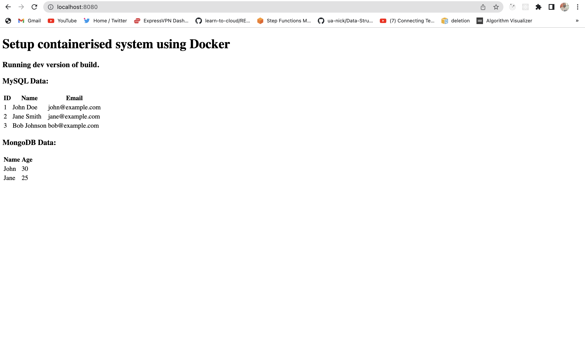

## DevOps Engineer Test Tasks

### Setup containerised system using Docker

To build the dev version of the web frontend container with Xdebug turned off:
```
make dev
```



Otherwise:
```
make prod
```


To destroy or tear down the environment:

```
make destroy
```

To further customise the application, [uncomment line 12](https://github.com/mosesbenjamin/lecturio-devops-assessment/blob/main/docker-compose.yml#:~:text=%23%20env_file%3A%20.env%20%23%20load%20values%20from%20.env%20file), 
create a .env file with values matching this [.env.example](.env.example) file, and [comment out line 13-22](https://github.com/mosesbenjamin/lecturio-devops-assessment/blob/main/docker-compose.yml#:~:text=from%20.env%20file-,environment%3A,%2D%20PHP_ENV%3D%24%7BENVIRONMENT%7D,-volumes%3A) for your changes to take effect 


