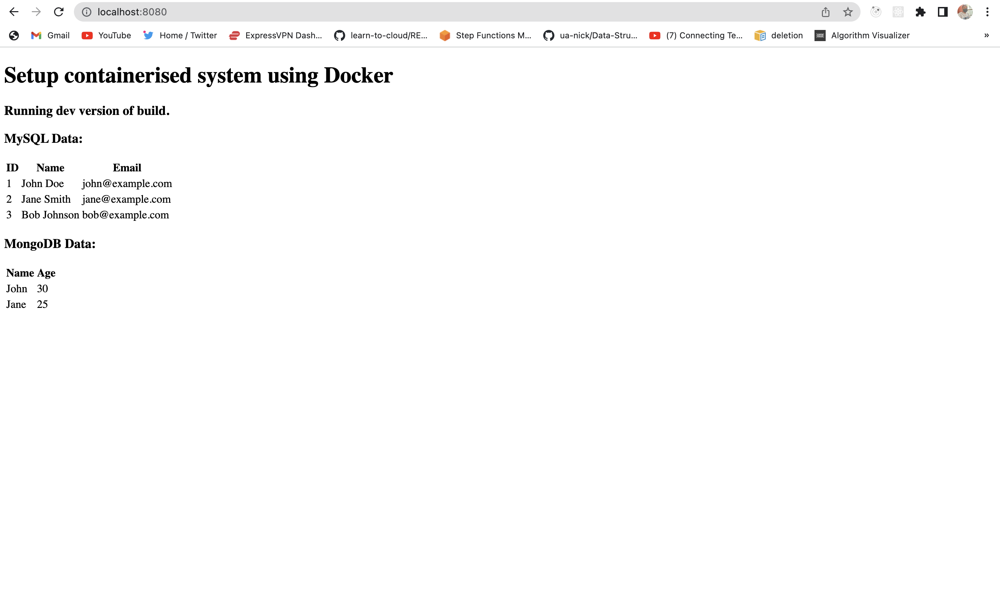

#### Prerequisites

- Docker and docker compose (Required)
- make (optioinal)

#### Linux, MacOS (with make installed)

To build the dev version of the web frontend container with Xdebug turned off:

```
make dev
```



Otherwise:

```
make prod
```


To clean up:

```
make destroy
```

#### Windows Powershell (with make installed)

To build the dev version of the web frontend container with Xdebug turned off:

```
make win_dev
```

Otherwise:

```
make win_prod
```

To clean up:

```
make win_destroy
```

#### Linux, MacOS (without make installed)

To build the dev version of the web frontend container with Xdebug turned off:

```
export MYSQL_HOST=mysql && \
export MYSQL_USER=root && \
export MYSQL_DATABASE=testdb && \
export MYSQL_ROOT_PASSWORD=rootpassword && \
export MONGO_HOST=mongo && \
export MONGO_DATABASE=test-mongo-db && \
export MONGO_INITDB_ROOT_USERNAME=root && \
export MONGO_INITDB_ROOT_PASSWORD=rootpassword && \
export ENVIRONMENT=dev && \
docker compose up --build
```

Otherwise:

```
export MYSQL_HOST=mysql && \
export MYSQL_USER=root && \
export MYSQL_DATABASE=testdb && \
export MYSQL_ROOT_PASSWORD=rootpassword && \
export MONGO_HOST=mongo && \
export MONGO_DATABASE=test-mongo-db && \
export MONGO_INITDB_ROOT_USERNAME=root && \
export MONGO_INITDB_ROOT_PASSWORD=rootpassword && \
export ENVIRONMENT=prod && \
docker compose up --build
```

To clean up:

```
unset MYSQL_HOST && \
unset MYSQL_USER && \
unset MYSQL_DATABASE && \
unset MYSQL_ROOT_PASSWORD && \
unset MONGO_HOST && \
unset MONGO_DATABASE && \
unset MONGO_INITDB_ROOT_USERNAME && \
unset MONGO_INITDB_ROOT_PASSWORD && \
unset ENVIRONMENT && \
docker compose down
```

#### Windows Powershell (without make installed)

To build the dev version of the web frontend container with Xdebug turned off:

```
$env:MYSQL_HOST="mysql"; `
$env:MYSQL_USER="root"; `
$env:MYSQL_DATABASE="testdb"; `
$env:MYSQL_ROOT_PASSWORD="rootpassword"; `
$env:MONGO_HOST="mongo"; `
$env:MONGO_DATABASE="test-mongo-db"; `
$env:MONGO_INITDB_ROOT_USERNAME="root"; `
$env:MONGO_INITDB_ROOT_PASSWORD="rootpassword"; `
$env:ENVIRONMENT="dev"; `
docker compose up --build
```

Otherwise:

```
$env:MYSQL_HOST="mysql"; `
$env:MYSQL_USER="root"; `
$env:MYSQL_DATABASE="testdb"; `
$env:MYSQL_ROOT_PASSWORD="rootpassword"; `
$env:MONGO_HOST="mongo"; `
$env:MONGO_DATABASE="test-mongo-db"; `
$env:MONGO_INITDB_ROOT_USERNAME="root"; `
$env:MONGO_INITDB_ROOT_PASSWORD="rootpassword"; `
$env:ENVIRONMENT="prod"; `
docker compose up --build
```

To clean up:

```
Remove-Item Env:\MYSQL_HOST; `
Remove-Item Env:\MYSQL_USER; `
Remove-Item Env:\MYSQL_DATABASE; `
Remove-Item Env:\MYSQL_ROOT_PASSWORD; `
Remove-Item Env:\MONGO_HOST; `
Remove-Item Env:\MONGO_DATABASE; `
Remove-Item Env:\MONGO_INITDB_ROOT_USERNAME; `
Remove-Item Env:\MONGO_INITDB_ROOT_PASSWORD; `
Remove-Item Env:\ENVIRONMENT; `
docker compose down
```

To further customise the application, [uncomment line 12](https://github.com/mosesbenjamin/lecturio-devops-assessment/blob/main/docker-compose.yml#:~:text=%23%20env_file%3A%20.env%20%23%20load%20values%20from%20.env%20file),
create a .env file with values matching this [.env.example](https://github.com/mosesbenjamin/lecturio-devops-assessment/blob/main/.env.example) file, and [comment out line 13-22](https://github.com/mosesbenjamin/lecturio-devops-assessment/blob/main/docker-compose.yml#:~:text=from%20.env%20file-,environment%3A,%2D%20PHP_ENV%3D%24%7BENVIRONMENT%7D,-volumes%3A) for your changes to take effect. Optionally, set env vars with values of your choosing.
